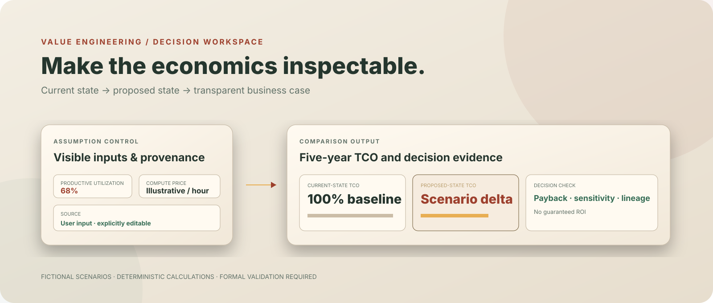
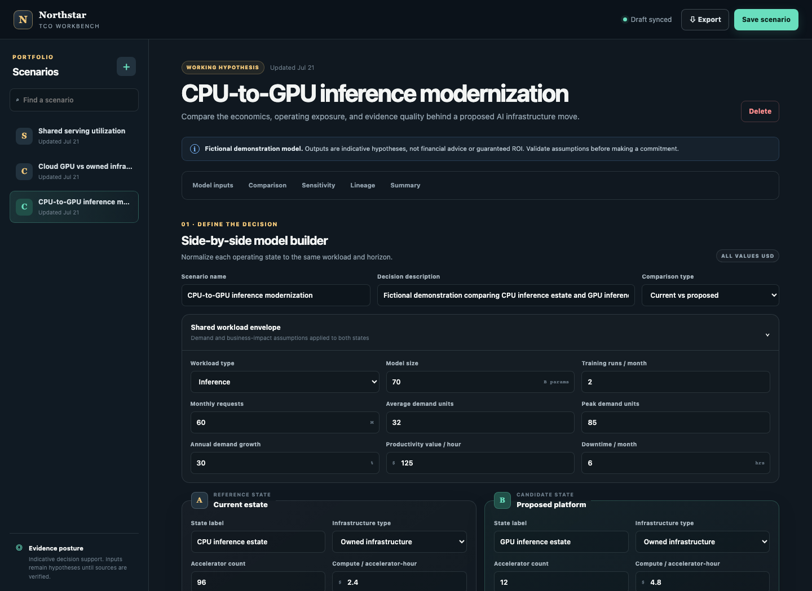
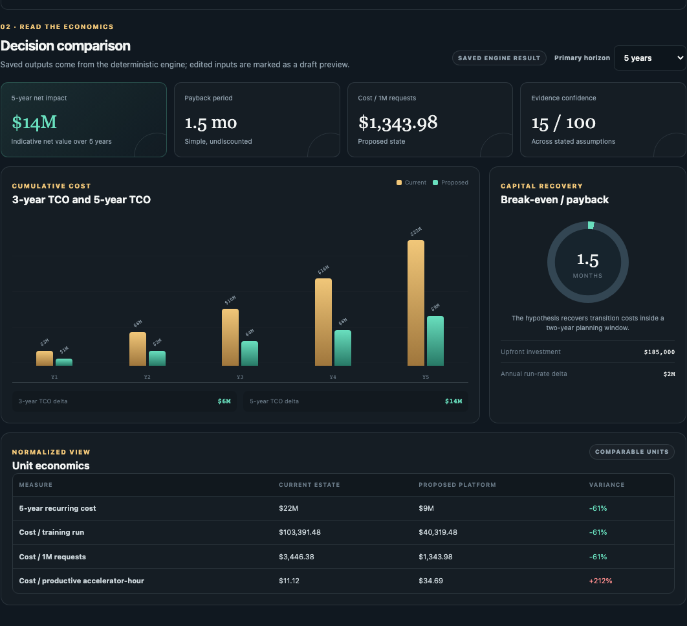
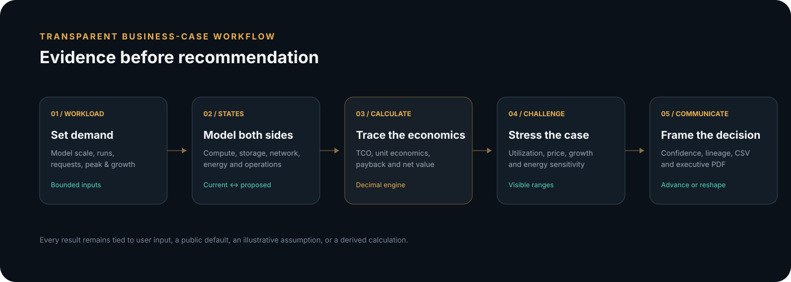
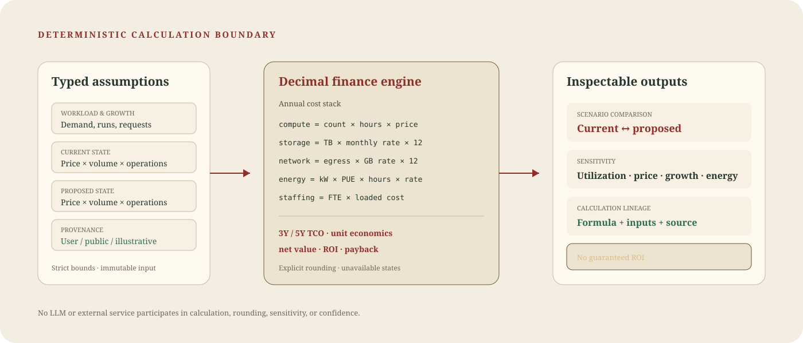

# Enterprise AI Infrastructure TCO & ROI Workbench

[](https://github.com/daetan999/ai-infra-tco-workbench/actions/workflows/ci.yml)
[](https://www.python.org/)
[](LICENSE)



A local-first decision workspace for comparing AI infrastructure operating models with transparent assumptions, deterministic financial calculations, sensitivity analysis, and executive-ready exports.

This project represents the **value engineering and business-case layer** of my enterprise AI infrastructure portfolio. It translates architecture choices into auditable three- and five-year economics without using a language model, external pricing feed, or opaque scoring service to calculate financial results.

> **Demonstration boundary:** every bundled organization, workload, price, and result is fictional or illustrative. Outputs are decision-support hypotheses—not financial advice, live vendor quotes, or guaranteed ROI.

## Visual system

The TCO workbench is styled as a **financial broadsheet**: parchment surfaces, forest-green decision
signals, and oxblood attention states replace the familiar dark AI dashboard. Newsreader gives
decision sections editorial authority, while DM Mono keeps figures, provenance, and formulas precise.
The restrained square geometry makes the workspace read as an auditable ledger rather than a generic
analytics product.

## Product walkthrough

The workspace keeps scenario inputs, operating assumptions, modeled economics, sensitivity ranges, calculation lineage, and the executive summary in one reviewable flow.



The saved comparison view uses the authoritative engine result and exposes TCO, payback, normalized unit economics, confidence, and the modeled direction of value.



Download the generated [fictional Northstar private-RAG business-case PDF](docs/examples/fictional-northstar-private-rag-business-case.pdf) to see the executive reporting output.

## What it demonstrates

- **Comparable operating models:** current versus proposed, cloud versus owned infrastructure, and utilization improvement.
- **Explicit inputs:** workload demand, growth, accelerator count, utilization, compute price, storage, network, power, PUE, staffing, transition cost, and contract horizon.
- **Decision outputs:** annual cost components, 3-year and 5-year TCO, unit economics, savings, modeled productivity value, net value, ROI, payback, and break-even status.
- **Sensitivity:** one-factor ranges for utilization, compute price, demand growth, and energy price.
- **Evidence posture:** editable source references, confidence labels, coverage scoring, and formula-level lineage.
- **Immutable history:** each update creates a new SQLite analysis version; historical runs are returned as stored rather than silently recalculated.
- **Executive exports:** JSON for system handoff, CSV for further analysis, and a formatted PDF board memo.

## How the decision flow works



1. Define a shared workload and the two infrastructure states.
2. Record pricing, operating, growth, and transition assumptions with provenance.
3. Save the scenario to run the deterministic `Decimal` engine.
4. Review comparable costs, unit economics, sensitivity, confidence, and lineage.
5. Export the immutable saved analysis for technical, finance, or executive review.

The implementation is a focused FastAPI modular monolith:



See [architecture](docs/architecture.md), [financial methodology](docs/methodology.md), and [modeling guardrails](docs/guardrails.md) for the design invariants and operating boundary.

## Design Decisions

- **Calculate with Decimal code, not generated narrative.** Reviewers can reproduce formulas and rounding. The model cannot invent missing context; approved assumptions or a revised scenario must supply it.
- **Preserve immutable analysis versions.** A reviewed result never changes when inputs or policy evolve. Version history uses more storage and requires explicit revision; an approved retention policy can archive old runs without rewriting them.
- **Gate recommendations by evidence confidence.** Low-confidence inputs can produce arithmetic but cannot support investment approval. This may delay an attractive case; sourced workload, pricing, implementation, and contract evidence can move it to conditional or decision review.

## Bundled fictional scenarios

When `SEED_DEMO_DATA=true`, an empty database receives exactly three demonstrations:

1. **Fictional Northstar Private RAG TCO** — the shared portfolio case, comparing an owned CPU inference estate with an owned GPU inference estate.
2. **Cloud GPU vs owned infrastructure** — a cloud GPU reservation versus an owned GPU cluster.
3. **Shared serving utilization** — dedicated model pools versus a shared serving platform.

Seeding is idempotent and never adds demonstrations to a database that already contains scenarios.

## Run locally

### Python

```bash
python3.12 -m venv .venv
source .venv/bin/activate
python -m pip install --upgrade pip
python -m pip install -e '.[dev]'
SEED_DEMO_DATA=true uvicorn app.main:app --reload
```

Open [http://127.0.0.1:8000](http://127.0.0.1:8000). By default, data is stored in `data/tco-workbench.db`; set `TCO_WORKBENCH_DB` to choose another SQLite path.

### Container

```bash
docker compose up --build
```

The container runs as a non-root user with a read-only filesystem, a dedicated data volume, a temporary `/tmp`, and `no-new-privileges`.

## API

Scenario endpoints return a consistent `{ "success", "data", "error" }` envelope. Inputs are validated with strict Pydantic schemas.

| Method | Route | Purpose |
| --- | --- | --- |
| `GET` | `/health` | Service health |
| `GET` | `/api/scenarios` | List the latest version of each scenario |
| `POST` | `/api/scenarios` | Evaluate and create a scenario |
| `GET` | `/api/scenarios/{scenario_id}` | Read the latest saved analysis |
| `PUT` | `/api/scenarios/{scenario_id}` | Evaluate and append an immutable version |
| `DELETE` | `/api/scenarios/{scenario_id}` | Archive a scenario while retaining immutable versions |
| `GET` | `/api/scenarios/{scenario_id}/versions` | List immutable analysis history |
| `GET` | `/api/scenarios/{scenario_id}/versions/{version}` | Read one historical version |
| `GET` | `/api/scenarios/{scenario_id}/exports/{format}` | Export `json`, `csv`, or `pdf` |

Interactive OpenAPI documentation is available at `/docs` while the service is running.

## Verification

```bash
# Unit and integration tests with branch coverage (80% minimum)
pytest

# Python lint and browser script syntax
ruff check app tests scripts
npm ci
npm run check

# Chromium decision journeys
npx playwright install chromium
npm run test:e2e

# Dependency audits
npm audit
pip-audit
```

CI repeats Python linting, tests and coverage, JavaScript checks, all browser flows, and a production container build.

## Repository map

```text
app/
  domain.py       Financial domain types and validation
  engine.py       Deterministic TCO, ROI, sensitivity, and lineage engine
  repository.py   SQLite scenario and immutable-version persistence
  routes.py       Validated CRUD, history, and export API
  exports.py      JSON, CSV, and executive PDF generation
static/           Accessible responsive decision workspace
templates/        FastAPI-rendered application shell
tests/            Unit, integration, contract, and Playwright tests
docs/             Architecture, methodology, guardrails, and portfolio evidence
```

## Trust and deployment boundary

- Financial calculations use deterministic code and explicit rounding; narrative text cannot change results.
- Exports read the saved analysis snapshot, preserving what reviewers actually approved.
- Archived scenarios leave the active workspace but remain in the local SQLite history until the database file is removed under an approved retention process.
- Errors are sanitized at the HTTP boundary, inputs are schema-validated, and exported responses disable content sniffing and caching.
- The included application is a **single-user local demonstrator**. Shared or production deployment requires authentication, authorization, tenant isolation, TLS, rate limits, retention controls, and an approved data-classification process.
- Do not enter customer identifiers, confidential configurations, credentials, production telemetry, proprietary prices, supplier quotes, or contract terms into a public demonstration.

## License

[MIT](LICENSE)

---

[Part of the Enterprise AI Infrastructure Portfolio](https://github.com/daetan999/technical_resume)
