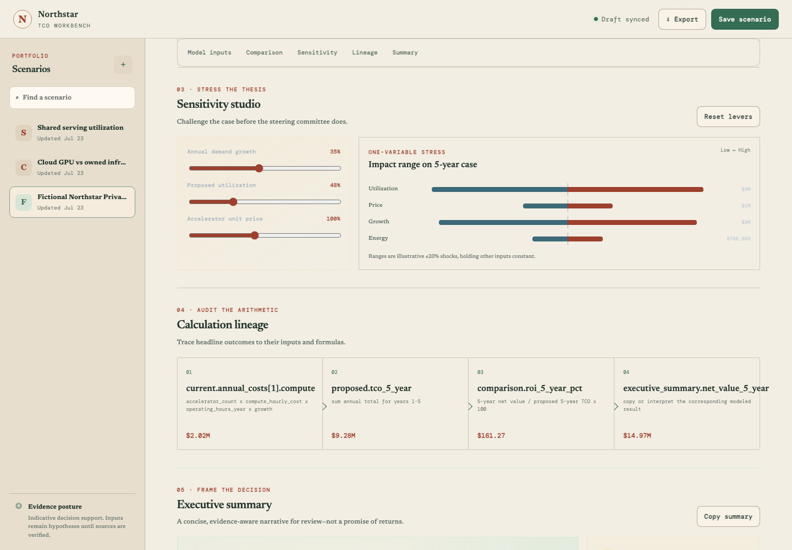

# AI Infrastructure TCO Workbench

[](https://github.com/daetan999/ai-infra-tco-workbench/actions/workflows/ci.yml)
[](LICENSE)
[](pyproject.toml)
[](pyproject.toml)
[](pyproject.toml)
[](pyproject.toml)
[](playwright.config.js)
[](Dockerfile)

A local decision workspace for comparing AI infrastructure operating models with explicit assumptions, deterministic financial calculations, sensitivity analysis, and review-ready exports.


*The seeded Northstar scenario compares a fictional CPU inference estate with a proposed GPU estate. All organizations, values, and results shown here are illustrative.*

## The decision it supports

Infrastructure choices rarely reduce to a purchase price. Utilization, demand growth, storage, network, power, staffing, transition cost, and evidence quality all change the case.

The workbench keeps those inputs and their provenance beside the resulting economics. It is designed to help a technical and financial review answer:

- Are the current and proposed states normalized to the same workload and time horizon?
- Which assumptions drive the difference in total cost?
- Does the case survive plausible changes in utilization, price, growth, and energy cost?
- Can a reviewer trace each headline result back to a formula and saved input?

> **Demonstration boundary:** this is a single-user portfolio application. It does not use live pricing feeds, customer data, or an AI model to calculate results. Its output is decision support—not a quote, financial advice, or a guaranteed return.

## From assumptions to a reviewable case

### 1. Build comparable operating states

The model builder applies one workload envelope to a reference state and a candidate state. Each scenario records demand, infrastructure, operating, transition, and contract assumptions, plus source notes and confidence labels.

### 2. Read the modeled economics

The saved comparison exposes five-year net impact, payback, normalized unit cost, evidence confidence, cumulative TCO, and the recurring-cost variance. The oxblood and forest-green series make the two operating states legible without turning the analysis into a generic dashboard.


### 3. Stress and audit the thesis

One-variable sensitivity ranges show which assumptions can move the five-year case. Calculation lineage then connects a source cost to proposed TCO, ROI, and the executive-summary value.



## Product capabilities

- Compare current versus proposed, build versus buy, cloud versus owned, utilization improvement, or vendor scenarios.
- Calculate annual cost components, three- and five-year TCO, unit economics, savings, modeled productivity value, net value, ROI, payback, and break-even status.
- Stress utilization, compute price, demand growth, and energy price with one-factor sensitivity ranges.
- Track assumption sources, confidence labels, evidence coverage, and formula-level lineage.
- Append immutable SQLite analysis versions instead of silently recalculating reviewed history.
- Export a saved analysis as JSON, CSV, or a formatted PDF memo.

## Visual system

The interface takes its cues from a financial broadsheet rather than the dark, glowing conventions common to AI tooling.

| Element | Treatment |
| --- | --- |
| Palette | Parchment workspace, forest-green decisions, oxblood comparison states |
| Typography | Newsreader for editorial hierarchy; DM Mono for figures, labels, and formulas |
| Geometry | Square rules, restrained borders, ledger-like tables, minimal shadow |
| Information posture | Sources, confidence, and lineage remain visible beside the financial case |

## How it works


1. Define the workload shared by both infrastructure states.
2. Record operating, pricing, growth, and transition assumptions with provenance.
3. Save the scenario to run the deterministic `Decimal` engine.
4. Review cost, unit economics, sensitivity, confidence, and formula lineage.
5. Export the stored analysis snapshot for further review.


The implementation is a focused FastAPI modular monolith:

| Layer | Responsibility |
| --- | --- |
| `app/schemas.py` | Strict Pydantic input and stored-analysis contracts |
| `app/engine.py` | Deterministic TCO, ROI, sensitivity, and lineage calculations |
| `app/repository.py` | SQLite persistence and immutable scenario versions |
| `app/routes.py` | Scenario CRUD, history, and export endpoints |
| `app/exports.py` | JSON, CSV, and PDF rendering from saved snapshots |
| `static/` and `templates/` | Responsive browser workspace |

Read the detailed [architecture](docs/architecture.md), [financial methodology](docs/methodology.md), and [modeling guardrails](docs/guardrails.md).

## Run locally

Requires Python 3.12 or newer.

```bash
python3.12 -m venv .venv
source .venv/bin/activate
python -m pip install --upgrade pip
python -m pip install -e '.[dev]'
SEED_DEMO_DATA=true uvicorn app.main:app --reload
```

Open [http://127.0.0.1:8000](http://127.0.0.1:8000). The seeded database receives three fictional scenarios only when it is empty. By default, data is stored at `data/tco-workbench.db`; set `TCO_WORKBENCH_DB` to use another path.

For a containerized run:

```bash
docker compose up --build
```

The Compose service uses a dedicated data volume, a read-only filesystem, a temporary `/tmp`, a non-root image user, and `no-new-privileges`.

## API surface

Scenario responses use a consistent `{ "success", "data", "error" }` envelope. Interactive OpenAPI documentation is available at `/docs` while the application is running.

| Method | Route | Purpose |
| --- | --- | --- |
| `GET` | `/health` | Service health |
| `GET` / `POST` | `/api/scenarios` | List latest scenarios or create one |
| `GET` / `PUT` / `DELETE` | `/api/scenarios/{scenario_id}` | Read, version, or archive a scenario |
| `GET` | `/api/scenarios/{scenario_id}/versions` | List immutable analysis history |
| `GET` | `/api/scenarios/{scenario_id}/versions/{version}` | Read one historical version |
| `GET` | `/api/scenarios/{scenario_id}/exports/{format}` | Export `json`, `csv`, or `pdf` |

## Verification

```bash
# Python unit, integration, route, repository, export, and contract tests
pytest

# Python and browser-script checks
ruff check app tests scripts
npm ci
npm run check

# Chromium decision journeys, including the narrow layout
npx playwright install chromium
npm run test:e2e

# Dependency audits
npm audit
pip-audit
```

Pytest enforces at least 80% branch coverage. CI runs the Python checks, Playwright journeys, and a production container build; see [`.github/workflows/ci.yml`](.github/workflows/ci.yml).

## Scope and limitations

- The calculation engine is deterministic, but the result is only as credible as the supplied inputs and sources.
- Sensitivity analysis varies one factor at a time; it is not a probabilistic simulation.
- Payback is simple and undiscounted. Review [the methodology](docs/methodology.md) before interpreting modeled value.
- Archived scenarios remain in local SQLite history until the database is removed under an appropriate retention process.
- Shared or production deployment would require authentication, authorization, tenant isolation, TLS, rate limiting, retention controls, and an approved data-classification process.
- Do not enter customer identifiers, credentials, production telemetry, proprietary prices, supplier quotes, or contract terms into a public demonstration.

## License

[MIT](LICENSE) · [Enterprise AI Infrastructure Portfolio](https://github.com/daetan999/technical_resume)
