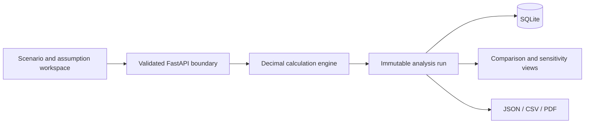

# Architecture

The workbench is a local-first FastAPI modular monolith. Strict Pydantic contracts separate user
inputs from a pure deterministic finance engine. SQLite stores versioned scenario inputs and
immutable analysis snapshots; exports read those snapshots rather than recalculating them.

## Audit invariants

- The same canonical inputs produce the same rounded results and lineage.
- Every material output names its formula, inputs, provenance, and derived value.
- Historical analysis runs are never recalculated on read.
- No model, pricing feed, cloud credential, or external API performs a financial calculation.
- Bundled values are fictional or illustrative and are never represented as live vendor quotes.

## Deployment boundary

The repository is a single-user local demonstrator. Shared or production use would require
authentication, authorization, tenant isolation, TLS, request limits, retention controls, and an
approved data-classification process.
